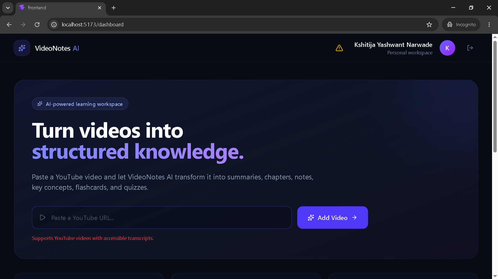
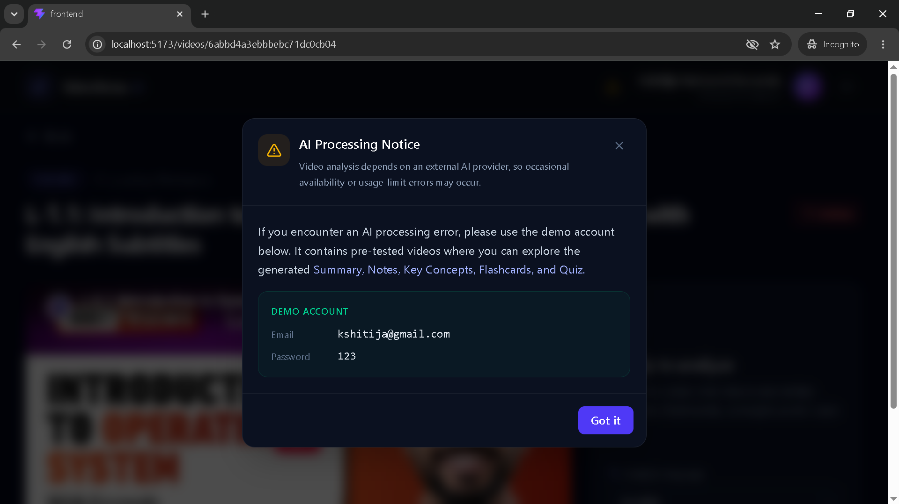
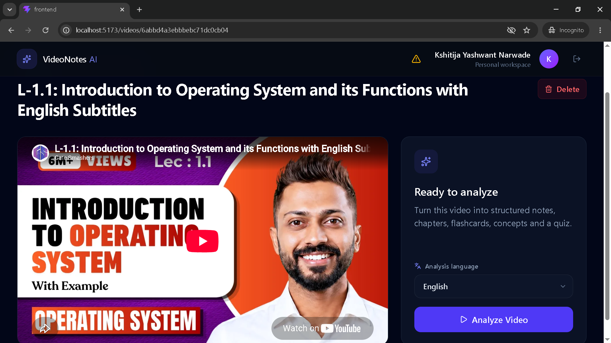
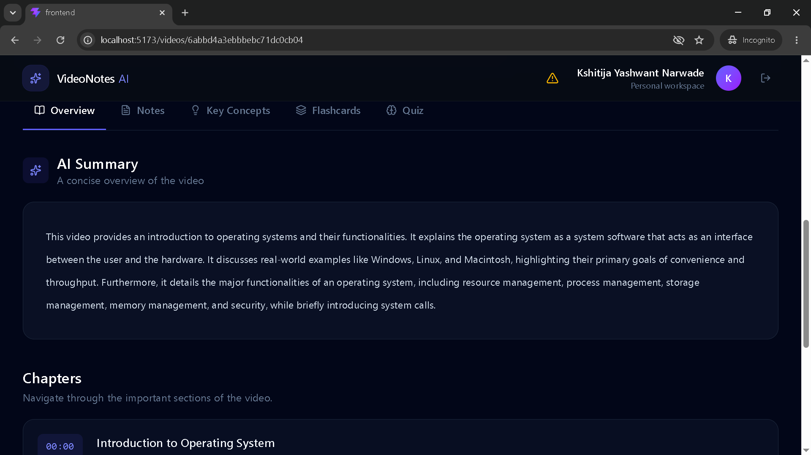
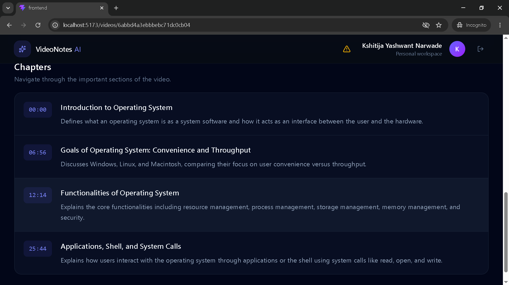
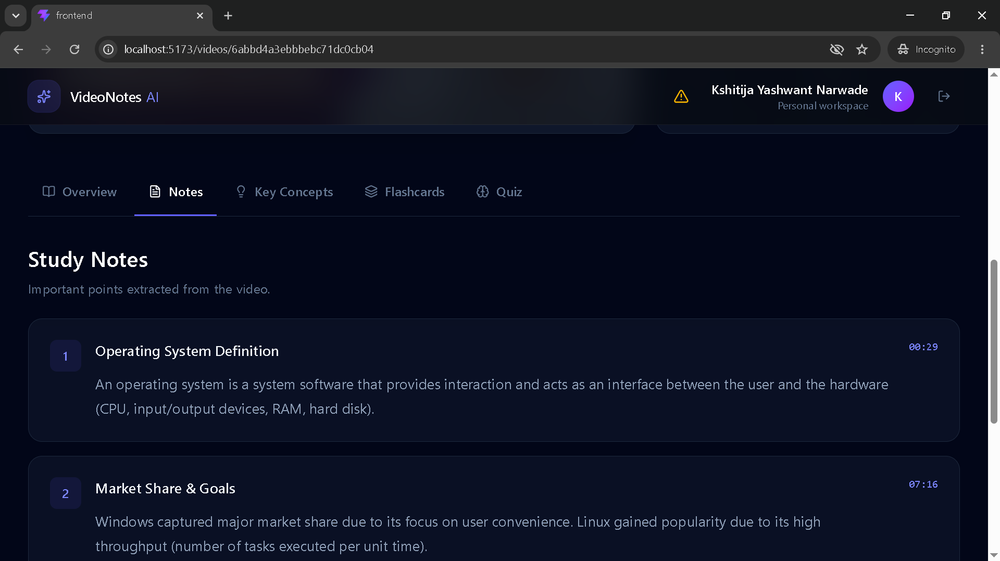
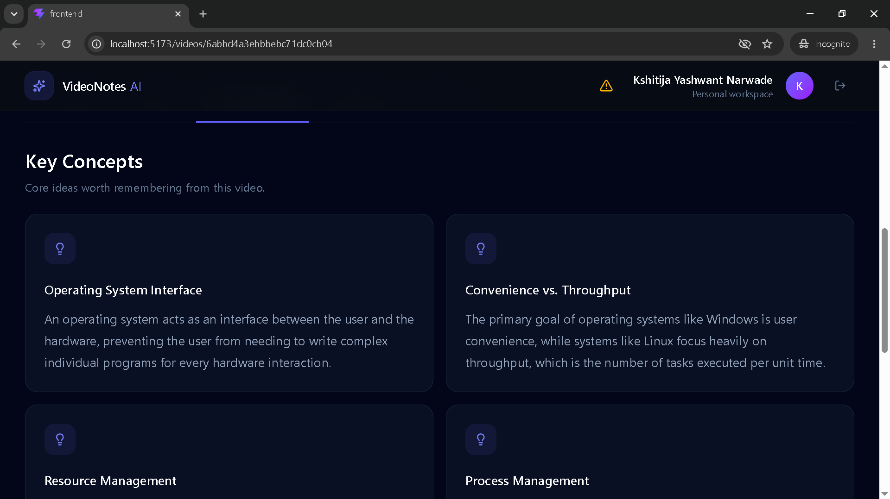
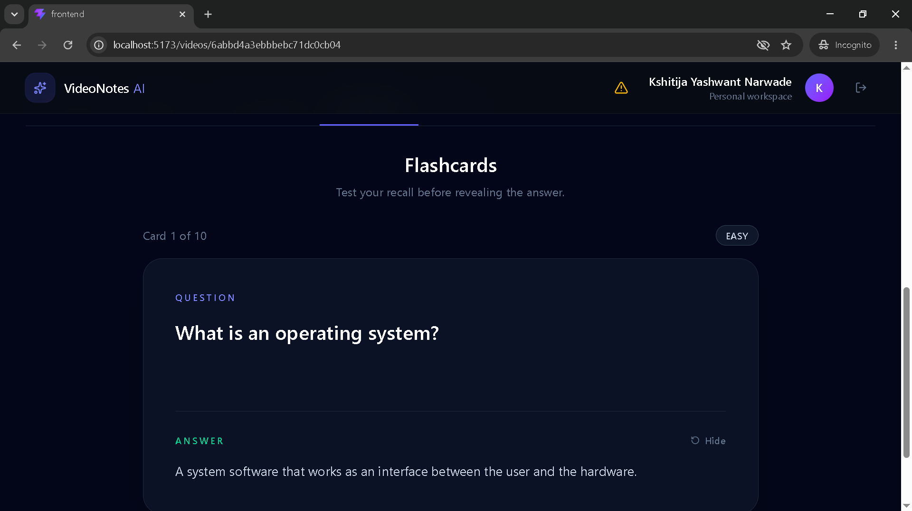
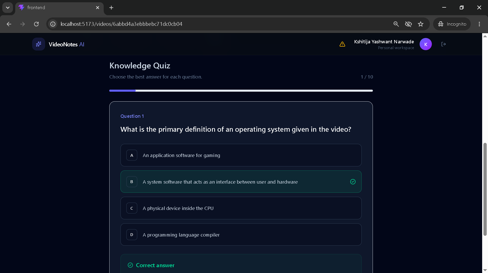

# 🎥 VideoNotes AI

> **Turn YouTube videos into structured knowledge.**

VideoNotes AI is an AI-powered learning application that transforms YouTube videos into structured study material.

Instead of watching a long video and manually taking notes, users can provide a YouTube URL and generate:

- 📝 Summary
- 📚 Structured Notes
- 💡 Key Concepts
- 🗂️ Chapters
- 🧠 Flashcards
- ❓ Quiz Questions

The application also provides a dedicated workspace where users can review and study the generated material.

---

## 📸 Screenshots

### Dashboard

The dashboard provides an overview of the user's videos, statistics, and a quick way to add a new YouTube video.



---

### Notice

The Notice provided in case of failure of AI processing .



---

### Video Analysis Workspace

After adding a video, users can select the analysis language and start the AI processing.



---

### Summary

The Summary provide the brief information about the given video.



---

### Chapters

The Chapters are listed according to the given timeStamp in the YouTube Video.



---

### Generated Notes

Once processing is completed, the application provides structured notes generated from the video.



---

### Key Concepts

Important concepts extracted from the video are presented in a structured format.



---

### Flashcards

Users can review important concepts using generated flashcards.



---

### Quiz

The application generates questions based on the video content to help users test their understanding.



---

## ✨ Features

### 🎥 YouTube Video Processing

Users can paste a YouTube URL and create a video analysis workspace.

The application extracts the available transcript and uses it as the primary input for AI analysis.

### 🤖 AI-Powered Analysis

The application generates structured learning material including:

- Summary
- Chapters
- Notes
- Key Concepts
- Flashcards
- Quiz Questions

### 🌍 Multi-Language Analysis

Users can select the language in which the generated study material should be produced.

### 🔐 Authentication

The application uses JWT-based authentication to protect user data and video resources.

### 👤 User-Specific Videos

Each authenticated user can access only their own videos.

### 🔄 Processing States

Videos move through different processing states:

```text
PENDING
   ↓
PROCESSING
   ↓
COMPLETED
   ↓
FAILED
```

Users can retry a failed analysis without creating the video again.

### 🗑️ Video Management

Users can delete videos along with their associated generated study material.

### ⚠️ AI Provider Error Handling

AI processing depends on an external AI provider.

Temporary provider failures, rate limits, or usage limits can cause analysis to fail.

The application handles these errors on the server and displays user-friendly messages instead of exposing internal provider errors.

# 🛠️ Tech Stack

## Frontend

| Technology   | Purpose                |
| ------------ | ---------------------- |
| React        | User interface         |
| TypeScript   | Type safety            |
| Vite         | Development/build tool |
| Tailwind CSS | Styling                |
| React Router | Client-side routing    |
| Axios        | API communication      |
| Lucide React | Icons                  |

## Backend

| Technology | Purpose                    |
| ---------- | -------------------------- |
| Node.js    | Runtime                    |
| Express.js | REST API                   |
| TypeScript | Type safety                |
| MongoDB    | Database                   |
| Mongoose   | MongoDB ODM                |
| JWT        | Authentication             |
| bcryptjs   | Password hashing           |
| CORS       | Cross-origin communication |

## AI / Data Processing

| Technology                 | Purpose                |
| -------------------------- | ---------------------- |
| AI Provider                | Video content analysis |
| YouTube Transcript Library | Transcript extraction  |
| MongoDB                    | Persistent storage     |

---

# 🏗️ Application Architecture

```text
                        ┌─────────────────────┐
                        │      User           │
                        └──────────┬──────────┘
                                   │
                                   ▼
                        ┌─────────────────────┐
                        │   React + Vite      │
                        │   TypeScript        │
                        │   Tailwind CSS      │
                        └──────────┬──────────┘
                                   │
                              REST API
                                   │
                                   ▼
                        ┌─────────────────────┐
                        │   Express Server    │
                        │     Node.js         │
                        └──────────┬──────────┘
                                   │
                 ┌─────────────────┼─────────────────┐
                 │                 │                 │
                 ▼                 ▼                 ▼
        ┌───────────────┐  ┌──────────────┐  ┌──────────────┐
        │ Authentication│  │   MongoDB    │  │ AI Provider  │
        │     JWT       │  │  Mongoose    │  │              │
        └───────────────┘  └──────────────┘  └──────┬───────┘
                                                     │
                                                     ▼
                                           Generated Study Material
                                                     │
                         ┌───────────────────────────┼──────────────────────────┐
                         │                           │                          │
                         ▼                           ▼                          ▼
                     Summary                      Notes                    Key Concepts
                         │                           │                          │
                         └───────────────────────────┼──────────────────────────┘
                                                     │
                                      ┌──────────────┴──────────────┐
                                      ▼                             ▼
                                  Flashcards                      Quiz
```

---

# 🔄 Video Processing Flow

When a user adds a YouTube video:

```text
User pastes YouTube URL
          │
          ▼
POST /videos
          │
          ▼
Create Video document
          │
          ▼
Status = PENDING
          │
          ▼
User opens Video Workspace
          │
          ▼
User selects language
          │
          ▼
Click "Analyze Video"
          │
          ▼
Status = PROCESSING
          │
          ▼
Fetch YouTube metadata
          │
          ▼
Fetch transcript
          │
          ▼
Send transcript to AI
          │
          ▼
Generate structured analysis
          │
          ├───────────────┐
          │               │
          ▼               ▼
       SUCCESS           ERROR
          │               │
          ▼               ▼
Status = COMPLETED    Status = FAILED
          │               │
          ▼               ▼
Save generated       Save friendly
study material       error message
```

---

# 📂 Project Structure

```text
videonotes-ai/
│
├── client/
│   │
│   ├── src/
│   │   ├── components/
│   │   │   ├── Notice.tsx
│   │   │   ├── LanguageSelect.tsx
│   │   │   └── Navbar.tsx
│   │   │
│   │   ├── context/
│   │   │   ├── NoticeContext.ts
│   │   │   ├── NoticeProvider.tsx
│   │   │   └── useNotice.ts
│   │   │
│   │   ├── pages/
│   │   │   ├── Dashboard.tsx
│   │   │   ├── Login.tsx
│   │   │   ├── Register.tsx
│   │   │   ├── VideoLibrary.tsx
│   │   │   └── VideoWorkspace.tsx
│   │   │
│   │   ├── services/
│   │   │   └── api.ts
│   │   │
│   │   ├── types/
│   │   │   └── index.ts
│   │   │
│   │   ├── utils/
│   │   │   └── languages.ts
│   │   │
│   │   ├── App.tsx
│   │   └── main.tsx
│   │
│   ├── package.json
│   └── ...
│
├── server/
│   │
│   ├── src/
│   │   ├── config/
│   │   │   └── db.ts
│   │   │
│   │   ├── controllers/
│   │   │   ├── auth.controller.ts
│   │   │   └── video.controller.ts
│   │   │
│   │   ├── middleware/
│   │   │   └── auth.middleware.ts
│   │   │
│   │   ├── models/
│   │   │   ├── User.ts
│   │   │   └── Video.ts
│   │   │
│   │   ├── routes/
│   │   │   ├── auth.routes.ts
│   │   │   └── video.routes.ts
│   │   │
│   │   ├── services/
│   │   │   ├── ai.service.ts
│   │   │   ├── youtube.service.ts
│   │   │
│   │   │
│   │   ├── utils/
│   │   │   └── ...
│   │   │
│   │   └── server.ts
│   │
│   ├── package.json
│   │
│   └── ...
│
├── docs/
│   └── screenshots/
│       ├── home.png
│       ├── login.png
│       ├── register.png
│       ├── dashboard.png
│       ├── key-concepts.png
│       ├── flashcards.png
│       ├── quiz
│       ├── notes.png
|       ├── chapters.png
|       └── summary.png
|
|
├── .gitignore
└── README.md
```

> The exact folder names may differ depending on your final project structure.

---

# 🔐 Authentication Flow

VideoNotes AI uses JWT-based authentication.

```text
Register
   │
   ▼
Password hashed using bcrypt
   │
   ▼
User stored in MongoDB
   │
   ▼
Login
   │
   ▼
JWT generated
   │
   ▼
Authentication cookie/token
   │
   ▼
Protected API requests
```

Protected video operations verify the authenticated user before accessing the video.

This ensures that users cannot access another user's videos by simply changing a video ID.

---

# 🗄️ Database

The application uses MongoDB with Mongoose.

## User

The user collection stores authentication and profile information.

```text
User
├── name
├── email
├── password
└── timestamps
```

## Video

The video collection stores the source video and generated learning material.

```text
Video
├── userId
├── youtubeUrl
├── youtubeId
├── title
├── description
├── thumbnailUrl
├── duration
├── status
├── transcript
├── summary
├── chapters[]
├── notes[]
├── keyConcepts[]
├── flashcards[]
├── quiz[]
├── references[]
├── processingError
└── timestamps
```

---

# 🤖 AI Analysis

The AI receives the extracted video transcript and generates structured learning material.

Conceptually:

```text
YouTube Video
      │
      ▼
Transcript
      │
      ▼
AI Analysis
      │
      ▼
Structured JSON
      │
      ├── Summary
      ├── Chapters
      ├── Notes
      ├── Key Concepts
      ├── Flashcards
      └── Quiz
```

The backend validates and stores the generated result before it becomes available in the frontend.

---

# 🌍 Supported Languages

The application supports multiple analysis languages through the language selector.

The selected language is sent to the backend during the processing request:

```text
Frontend
   │
   │ { language: "en" }
   ▼
POST /videos/:id/process
   │
   ▼
AI Analysis Service
   │
   ▼
Generated content in selected language
```

---

# 🔌 API Endpoints

## Authentication

### Register

```http
POST /auth/register
```

Creates a new user account.

### Login

```http
POST /auth/login
```

Authenticates a user.

### Logout

```http
POST /auth/logout
```

Logs the current user out.

### Current User

```http
GET /auth/me
```

Returns the authenticated user's information.

---

## Videos

### Create Video

```http
POST /videos
```

Creates a new video workspace.

### Get Videos

```http
GET /videos
```

Returns videos belonging to the authenticated user.

### Get Video

```http
GET /videos/:id
```

Returns a specific user's video.

### Process Video

```http
POST /videos/:id/process
```

Starts AI processing.

Example request:

```json
{
  "language": "en"
}
```

### Delete Video

```http
DELETE /videos/:id
```

Deletes the video and its generated study material.

---

# ⚠️ AI Provider Limitations

VideoNotes AI relies on an external AI provider for generating study material.

Therefore, AI processing can occasionally fail because of:

- Temporary provider unavailability
- Rate limits
- Usage limits
- Provider-side service interruptions

The application handles these situations by:

1. Marking the video as `FAILED`.
2. Saving a user-friendly error message.
3. Avoiding exposure of internal provider errors.
4. Allowing the user to retry the analysis.

For evaluation, a dedicated demo account can be provided with pre-tested videos.

---

# 🎓 Demo Account

If you are evaluating the application and encounter an AI processing issue, use the dedicated demo account.

```text
Email:    kshitija@gmail.com
Password: 123
```

The account contains pre-tested videos with generated:

- Summary
- Notes
- Key Concepts
- Flashcards
- Quiz

> **Important:** The demo credentials should be for a dedicated demo account only. Do not use personal or administrator credentials.

---

# ⚙️ Environment Variables

## Backend

Create:

```text
server/.env
```

Example:

```env
PORT=5000

MONGODB_URI=your_mongodb_connection_string

JWT_SECRET=your_jwt_secret

FRONTEND_URL=http://localhost:5173

AI_API_KEY=your_ai_api_key
```

Replace the values with your own credentials.

**Never commit `.env` files or API keys to GitHub.**

---

## Frontend

Create:

```text
client/.env
```

Example:

```env
VITE_API_URL=http://localhost:5000/api
```

---

# 🚀 Getting Started

## 1. Clone the repository

```bash
git clone https://github.com/YOUR_USERNAME/videonotes-ai.git
```

```bash
cd videonotes-ai
```

---

## 2. Install frontend dependencies

```bash
cd client
npm install
```

---

## 3. Install backend dependencies

Open another terminal:

```bash
cd server
npm install
```

---

## 4. Configure environment variables

Create the required `.env` files.

### Backend

```text
server/.env
```

### Frontend

```text
client/.env
```

---

## 5. Start the backend

```bash
cd server
npm run dev
```

The backend should start on:

```text
http://localhost:5000
```

---

## 6. Start the frontend

In another terminal:

```bash
cd client
npm run dev
```

The frontend should be available at:

```text
http://localhost:5173
```

---

# 🧪 Testing the Application

Recommended testing flow:

```text
1. Register
      ↓
2. Login
      ↓
3. Open Dashboard
      ↓
4. Paste YouTube URL
      ↓
5. Click "Add Video"
      ↓
6. Select analysis language
      ↓
7. Click "Analyze Video"
      ↓
8. Wait for processing
      ↓
9. Explore generated material
```

After successful processing, verify:

- Summary
- Chapters
- Notes
- Key Concepts
- Flashcards
- Quiz

Also test the failure flow:

```text
AI processing
      ↓
FAILED
      ↓
User-friendly error
      ↓
Try Again
      ↓
PROCESSING
```

---

# 🎯 Project Goals

The main goals of VideoNotes AI are:

- Reduce the effort required to take notes from educational videos.
- Convert unstructured video content into structured learning material.
- Provide multiple study formats from the same source.
- Make long educational videos easier to revise.
- Demonstrate practical use of AI APIs in a full-stack application.

---

# 🔮 Future Improvements

Potential future improvements include:

- 💬 Chat with Video
- 🔎 Semantic search
- 🧠 Retrieval-Augmented Generation (RAG)
- 📄 PDF/document analysis
- 🎙️ Audio transcription
- 📊 Learning progress tracking
- 🔖 Bookmark important timestamps
- 📱 Improved mobile experience
- 🔄 Background job processing
- ⚡ Redis/job queue integration
- 📚 Multiple video collections
- 👥 Shared study collections

---

# 🧠 What I Learned

Building this project helped me work with:

- React + TypeScript
- Node.js + Express
- MongoDB + Mongoose
- REST API design
- JWT authentication
- Protected routes
- Axios
- External API integration
- YouTube transcript extraction
- AI API integration
- Structured AI responses
- Error handling
- Async/background processing
- State management
- Responsive UI design
- TypeScript interfaces and types

---

# 📌 Project Status

**Current status:** MVP / Active Development

The core workflow is implemented:

```text
Authentication              ✓
YouTube URL input           ✓
Video creation              ✓
Transcript extraction       ✓
AI analysis                 ✓
Summary                     ✓
Notes                       ✓
Key Concepts                ✓
Flashcards                  ✓
Quiz                        ✓
Video workspace             ✓
Processing states           ✓
Error handling              ✓
Retry                       ✓
Video deletion              ✓
Demo account                ✓
```

Additional features such as RAG, chat with videos, and document analysis can be added in future iterations.

---

# 👨‍💻 Author

**Kshitija Yashwant Narwade**

Full Stack Developer

### Technologies

`React` · `TypeScript` · `Node.js` · `Express` · `MongoDB` · `Tailwind CSS` · `AI`

---

### Project demo URL

- GitHub: `(https://video-notes-ai-two.vercel.app/)`

---

### Connect

- GitHub: `(https://github.com/KshitijaNarwade/)`
- LinkedIn: `(https://www.linkedin.com/in/kshitija-narwade-4941b0401)`

---


# ⭐ Support

If you find this project useful, consider giving the repository a ⭐ on GitHub.
